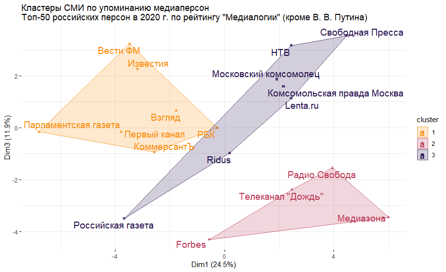
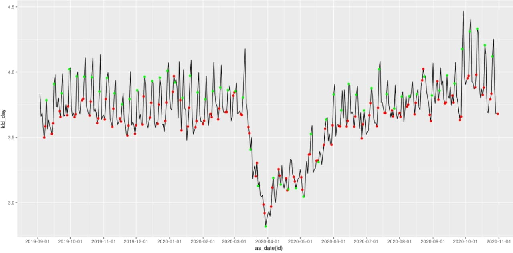

# Federal media EDA
**Status: In progress**

The idea of the project is to cover Russian federal media discourse, primary around the Covid pandemic in 2020, and to suggest the composition of these media how similar they are and in what way. 

[Media used in the study](media_namews) and period of the news coverage: 29 July 2019 - 30 October 2020

### Main tasks:
* Covid discourse and its dynamics, how it started, and how it proceeded. For example, firstly, the media were covering topic masks and how to behave in public and later about the governmental control related to Covid. 
* Clusterization of media. We clusterized media based on the media persons they mention, the audience they share in VK, and what topics they cover from the result of a correlated topic model.

 ## My part of the project:
 * [Correlated topic modeling](savemodel_script.R)
 * [VK groups scraper](pub_scraper.py) - Infinite scroll scraper of groups/publics id in VK. VK provides a search of the groups with a certain type of media and also with a category filter. The filtering is not implemented in VK API, that's why we scrap id through the VK website itself, however, the search is limited to 1000 groups.
 * [public.ru XML to csv](publicru_xml_to_csv.r) - Converter of news from [public.ru](public.ru) (XML format to CSV)
 * [The share of Covid news in 2020 across different media](media_covid_heatmap.R)
 * [Mentions of media persons in news](mlg_persons_count.R) - Counting how many news mention popular persons according to [mlg.ru](https://www.mlg.ru/ratings/itogi2019/7976/). Based on mentions of popular persons we further cluster media. So, it looks something like this:
 

 ## To be added:
 * Data
 * Clusterization from the share of VK audience with and without [backbone extraction](https://www.pnas.org/content/106/16/6483)
 * Permutation test to identify which media significantly differ in their mentioning of the certain topic
 * More pictures!

 ## To be continued:

 [Novelty](novelty_media.R) and [resonance](resonance_media.R) of the news - Novelty of the news is a KLD based measure that tells us how surprising is the news in the day _t_ compared to the news in the day _t - 1_. We calculate KLD based on topics distribution of single today news compared with topics distribution of every news yesterday. Then we mean the values we get and it indicates how this single news differs from all of the news the day before. Now we need to extrapolate this idea for every news of the day. Resonance is a similar measurement, but we compare news in the day _t_ with the news in the day _t + 1_. More about what you can do with novelty and resonance you can read [here](https://pubmed.ncbi.nlm.nih.gov/29666239/). My implementation and data are similar to [NDHL](https://centre-for-humanities-computing.github.io/Nordic-Digital-Humanities-Laboratory/portfolio/news_c19_method/), but I use correlated topic modeling instead of LDA and the size of the frame for news comparison is not fixed but based on the number of news in each day. For example, on the weekend day, the number of news is twice lower than on an average weekday, that's why I think if we want to know the dynamic by day and we have a long period of observation we should use a moving size frame.

 
